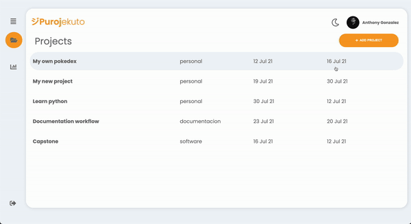

<h1 align="center">
   
  
</h1>

  <a href="#key-features">Key Features</a> •
  <a href="#specifications">Specifications</a> •
  <a href="https://purojekuto-master.herokuapp.com/" target="_blank">Demo</a> •
  <a href="#collaborators">Collaborators</a>

   

      <b>Purojekuto</b> is the application where project managers can centralize all their projects, we connect with user google calendar to add Calendar and activities base on the their projects. <i>Solution creared for Platzi Master Capstone project.</i>
   

  

  <i>Take a look of our cool demo our <a href="https://purojekuto-master.herokuapp.com/">here.</a> 🤖
  </i>

 

## Key Features

- Login with your google acount.
- Create project three kind of projects (Software, Documentation and Personal).
- Setup a start day and deathline to each project.
- Setup how many hours you want to invest a week for each project.
- Setup your break times by project.
- Create different types of events like coding, research, meeting, break, etc.
- See your events by project in our application calendar.
- Take a look at your statistics of invested hours by project
- Dark mode.

 

## Specifications 

The application was made with <b>React and NextJs as core</b>, Sass as preprocessor, React context API and localStorage to persist data between components, Axios for https request, React Hook Form for inputs validation.

- [React](https://reactjs.org/)
- [NextJs](https://nextjs.org/)
- [SASS](https://sass-lang.com/)

 

## Collaborators

- [@thomasnrggo](https://github.com/thomasnrggo)
- [@antuansabe](https://github.com/antuansabe)
- [@tanamix22](https://github.com/tanamix22)

